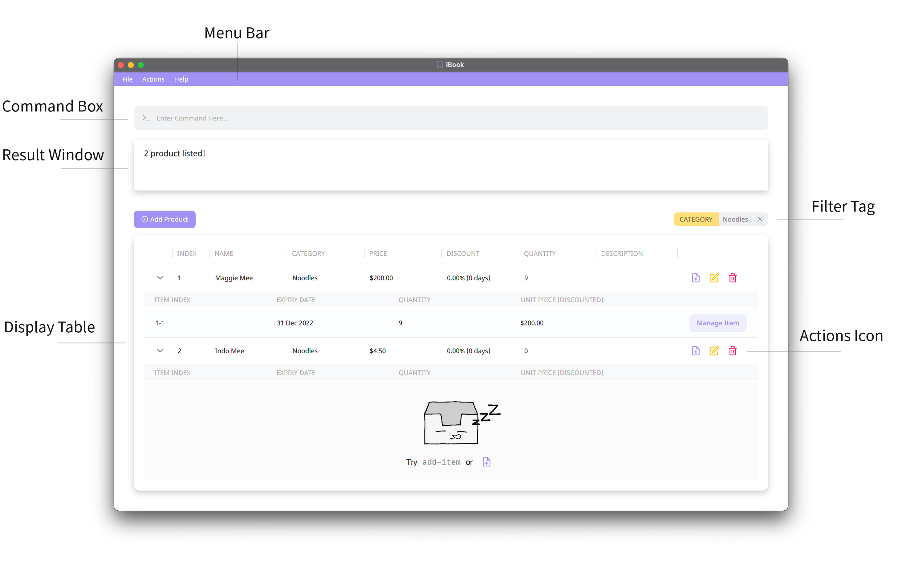
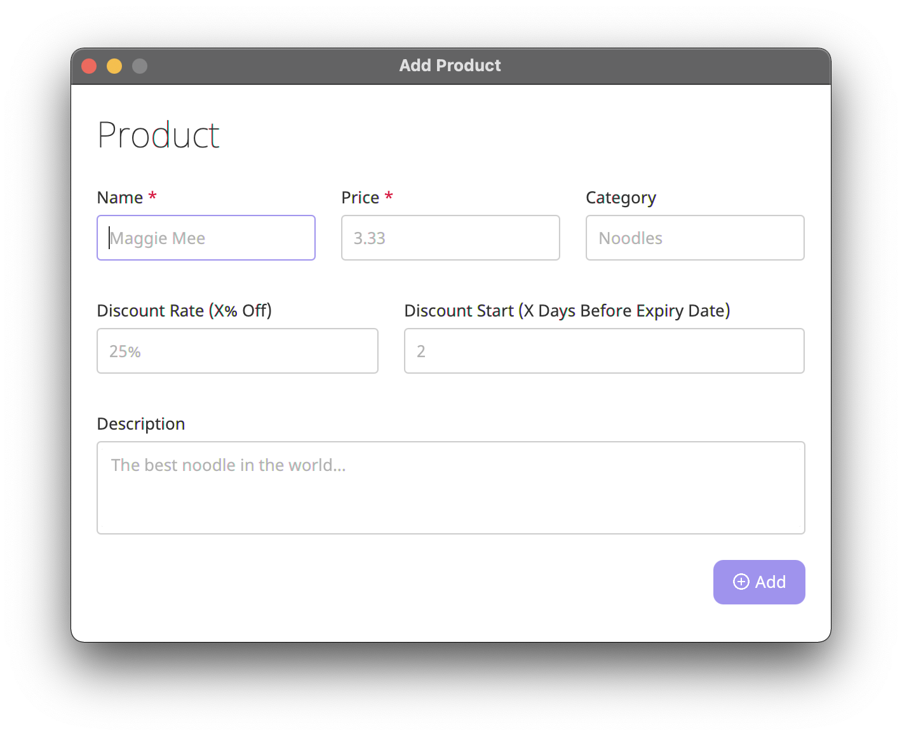
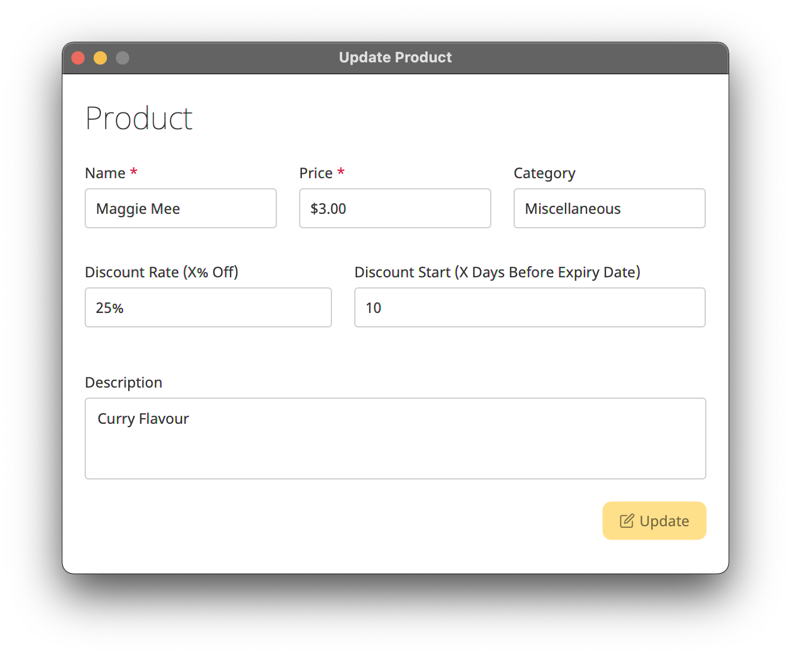
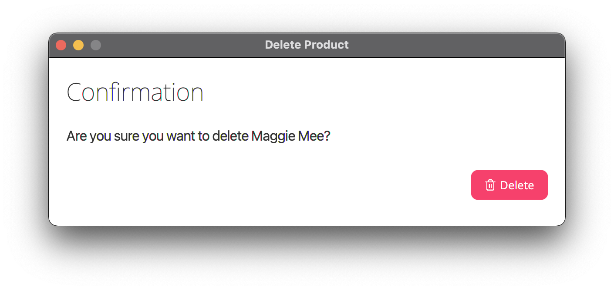
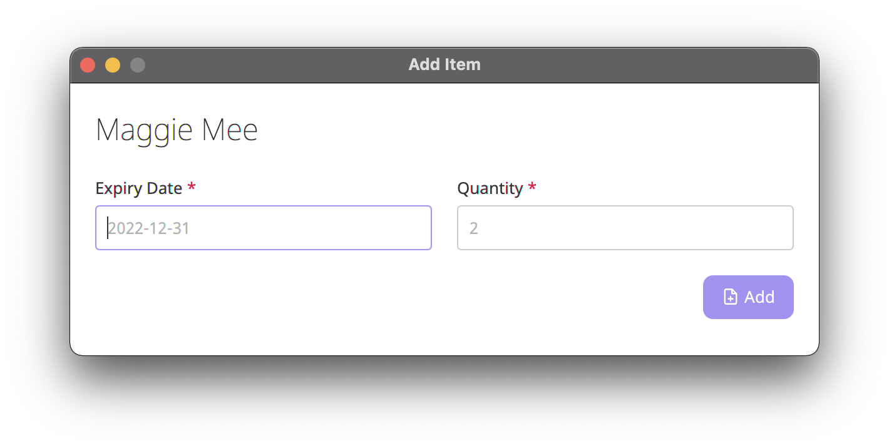

IBook is an inventory organizing system specially designed to manage products in a store.

<h2>Target User</h2>

IBook's target users are small-scale grocery storekeepers who are having issues with product organization and keeping track of expiring items.

We aim to help these storekeepers by

1. Simplifying the process of inventory organization.
2. Minimizing groceries wastage due to unnoticed expiring of items.

<h2>Structure of This Document</h2>

This document is structured chronologically so that you can follow through with this guide while using the product.

If you feel lost at any point in time, you can always refer to the Table of Contents.

<h2>Table of Contents</h2>

* Table of Contents
{:toc}

## 1. Quickstart

1. Ensure you have [Java 11](https://www.oracle.com/java/technologies/downloads/) or above installed on your computer.

2. Download the latest `ibook.jar` from [here](https://github.com/AY2122S2-CS2103T-T09-4/tp/releases).

3. Copy the file to the folder you want to use as the home folder for iBook.

4. Type `java -jar ibook.jar` in a terminal in the same directory as the file to start it. Alternatively, double-click the file to start the app.

    If you are using macOS, please look at [FAQ](#5-faq) before proceeding.

    An interface similar to the image below should appear in a few seconds.

    

5. Type the command in the command box and press enter to execute it.

    Some example commands you can try:

   * **`list`** : Lists all products.

   * **`add n:Maggie Mee c:noodles p:3.00 d:curry flavour`** : Adds a product named `Maggie Mee` to iBook.

   * **`delete 3`** : Deletes the 3rd product shown in the displayed product list.

6. Refer to the [Features](#3-features) below for details of each command.

## 2. Reading the document

This section will introduce you to the different symbols and syntax that are used throughout this guide.

Please read through this section before proceeding further to avoid getting confused.

#### 2.1 Text Style

Text that appears in `this` style are special terms or commands related to iBook.

#### 2.2 Special Boxes

**Additional Information**

Text that appears in an information box indicates additional information that is good to know.

:information_source: **Information:**
Example additional information.

**Caution**

Text that appears in a caution box should be followed carefully to avoid unintended consequences.

:exclamation: **Caution:**
Example warnings.

**Tip**

Text that appears in a tip box is useful information to improve your experience with iBook.

:bulb: **Tip:**
Example tip.

#### 2.3 Sections of the Application Window

The application window is divided into a Command Box, Result Window as well as a Display Table that includes all the products.

The main mode of navigation in iBook is through the Command-line Interface (CLI).

You can type in commands into the command box and press enter on your keyboard to execute them.

Alternatively, you can interact with the application through buttons, such as the  button.

Either way, the result window will display the results of executing the command. The display table will update accordingly based on the executed command.

#### 2.4 Feature Format

Each command will be described in the following format.

  <h4>x.x.x Do something: <code class="language-plaintext highlighter-rouge">xxx-command</code></h4>
  
Do something very important

  
Format : <code class="language-plaintext highlighter-rouge">xxx-command XXX YYY [AAA] [BBB]</code>

  <table>
    <tbody>
      <tr>
        <td>Compulsory Fields</td>
        <td>
          <code class="language-plaintext highlighter-rouge">XXX</code>,
          <code class="language-plaintext highlighter-rouge">YYY</code>
        </td>
      </tr>
      <tr>
        <td>Optional Fields</td>
        <td>
          <code class="language-plaintext highlighter-rouge">AAA</code>,
          <code class="language-plaintext highlighter-rouge">BBB</code>
        </td>
      </tr>
    </tbody>
  </table>
  <ul>
    <li>Information 1…</li>
    <li>Information 2…</li>
  </ul>
  
Examples : 

  <ul>
    <li><code class="language-plaintext highlighter-rouge">xxx-command XXX YYY</code></li>
  </ul>
  <h5>GUI alternative</h5>
  
...

Although iBook is a CLI based application, we do provide a GUI alternative for some of the commonly used commands.

If a command has a GUI alternative, the subheading GUI alternative will be included in the same section.

You can interact with the application through buttons, such as the  button.

:bulb: **Product and Item:**

As most of the commands revolve around products and items. We advise you to take a look at the [Glossary](#6-glossary) section for our definition of products and items before proceeding.

#### 2.5 Command Format

* **Words in `UPPER_CASE` are additional user inputs supplied to a command.**  
  e.g. In the `add n:NAME` command, `NAME` is an input that can be supplied as `add n:Maggie Mee`.

* **Inputs in square brackets are optional.**  
  e.g. If the command specifies `n:NAME [c:CATEGORY]`, both `n:Maggie Mee c:noodle` and `n:Maggie Mee` are acceptable.

* **Inputs separated by a vertical bar (`|`) inside brackets denote that either one of them can be provided, *but not both*.**  
  e.g. if the command specifies `[p:PRICE | sp:START_PRICE ep:END_PRICE]`, then an empty input, `p:2.00`, and `sp:1.00 ep:5.00` are all acceptable. However, `p:2.00 sp:1.00 ep:5.00` is not accepted.

* **Inputs of a command can be in any order.**  
  e.g. if the command specifies `n:NAME c:CATEGORY`, `c:CATEGORY n:NAME` is also acceptable.

* **Extra inputs for commands that do not take in any (such as `exit`, `list`, `expired`, `out-of-stock`) will be ignored.**  
  e.g. the command `exit 123` will be interpreted as `exit`.

* **If two inputs of the same tag are given, the latter will be taken.**  
  e.g. the command `add n:Maggie Curry n:Maggie Chicken p:3.00 p:3.50` will add a product with the name `Maggie Chicken` and with a price of `3.50`.

**:exclamation: Important notes about inputs:** 

Inputs containing a colon (`:`) might cause unexpected behaviour. You are strongly recommended to add a backslash (`\`) before a colon character in your input.  
e.g. To provide a product name of `Nescafe: special edition`, you should type `n:Nescafe\: special edition`.

#### 2.6 Command inputs

| Input            | Description                                                                                  |
|:-----------------|:---------------------------------------------------------------------------------------------|
| `NAME`           | Name of the product.                                                                         |
| `CATEGORY`       | Category of the product.                                                                     |
| `PRICE`          | Price of the product. A valid price is a positive number, possibly prepended by a `$` sign.  |
| `START_PRICE`    | Start price of the product. Used for `find` command.                                         |
| `END_PRICE`      | End price of the product. Used for `find` command.                                           |
| `DESCRIPTION`    | Description of the product.                                                                  |
| `EXPIRY_DATE`   | Expiry date of the item.                                                                     |
| `QUANTITY`       | Quantity of the item.                                                                        |
| `DISCOUNT_RATE`  | Percentage of discount given to an item once it nears the expiry date.                       |
| `DISCOUNT_START` | Number of days before the expiry date to start the discount.                                 |

## 3. Features

### 3.1 Product Commands

#### 3.1.1 Listing all products : `list`

Shows the list of all products in iBook.

Format: `list`

| Compulsory Fields | |
| Optional Fields   | |

* All products will be listed on the main table.
* Click  on the left side of the product to view the items of the product.

Example:

* After running the `list` command, the table should look similar to the image below.

#### 3.1.2 Adding a product : `add`

Adds a new product to iBook.

Format: `add n:NAME p:PRICE [c:CATEGORY] [d:DESCRIPTION] [dr:DISCOUNT_RATE] [ds:DISCOUNT_START]`

| Compulsory Fields | `NAME`, `PRICE`                                              |
| Optional Fields   | `CATEGORY`, `DESCRIPTION`, `DISCOUNT_RATE`, `DISCOUNT_START` |

* Only a single product would be added at a time.
* The new product added must not be of the same `NAME` and `CATEGORY` as any existing products in iBook.
* The `NAME` and the `PRICE` fields cannot be empty.
* If the `CATEGORY` field is not specified or is empty, the default category, `Miscellaneous`, would be used.
* The default `DISCOUNT_RATE` is 0%.
* The default `DISCOUNT_START` is 0.

Examples:

* `add n:Maggie Mee p:3.00 c:noodles d:curry flavour dr:25 ds:10`.

<h5>GUI Alternative</h5>

Click   button above the table to add a new product.

A pop-up window similar to the image shown next will appear.

You can now fill in the name and the price. Optionally, you can also fill in the category, description, discount rate and discount start.

:information_source: Required fields have a red asterisk `*` beside their label.

After filling in the required fields, click
 to add a new product.

#### 3.1.3 Updating a product : `update`

Updates the product at the specified `INDEX`.

Format: `update INDEX [TAG:NEW_VALUE ...]`

Valid tags and their values: `[n:NAME] [c:CATEGORY] [p:PRICE] [d:DESCRIPTION] [dr:DISCOUNT_RATE] [ds:DISCOUNT_START]`

| Compulsory Fields | `INDEX`, Must provide at least one of the optional fields                      |
| Optional Fields   | `NAME`, `CATEGORY`, `PRICE`, `DESCRIPTION`, `DISCOUNT_RATE`, `DISCOUNT_START`  |

* The index refers to the index of a product as shown in the table.
* The index must be **a positive integer** (1, 2, 3, …).
* At least one of the optional fields must be provided.
* Existing values will be updated to the new values.

Examples:
* `update 2 p:14.99` Updates the price of the 2nd product to be `14.99`.
* `update 3 c:bread d:ABC brand` Updates the category of the 3rd product to `bread` and its description to `ABC brand`.

<h5>GUI Alternative</h5>

Click  on the right side of any product in the table to update the product.

A pop-up window similar to the image shown next will appear

You can now change the details of the product.

After finishing updating the details, click
 to update the product.

#### 3.1.4 Deleting a product : `delete`

Deletes the product at a specified `INDEX`.

Format: `delete INDEX`

| Compulsory Fields | `INDEX` |
| Optional Fields   |         |

* The index refers to the index of a product as shown in the table.
* The index **must be a positive integer** (1, 2, 3, …).

Examples:
* `list` followed by `delete 2` deletes the 2nd product in the iBook.

<h5>GUI Alternative</h5>

Click  on the right side of any product to delete the product.

A pop-up window similar to the image below will appear.

You can now delete the product by clicking the  button.

#### 3.1.5 Finding products : `find`

Finds products that fit certain filters.

Format: `find [TAG:VALUE ...]`

Valid tags and their values: `[n:NAME] [c:CATEGORY] [p:PRICE | sp:START_PRICE ep:END_PRICE] [d:DESCRIPTION]`

| Compulsory Fields |  Must provide at least one of the optional fields                          |
| Optional Fields   | `NAME`, `CATEGORY`, `PRICE` or (`START_PRICE` `END_PRICE`), `DESCRIPTION` |

* For the name, category and description fields, the value provided can be a partial match of the exact product.
* To search for a specific price, `PRICE` should be used.
* To search for a range of prices, `START_PRICE` and `END_PRICE` should be used instead.
* If the `START_PRICE` is provided, the `END_PRICE` must also be provided, and vice versa.
* At least one of the optional fields must be provided.

Examples:

* `find n:Water` finds all products that contain `Water` in the name.
* `find n:Bread c:Food` finds all products that contain `Bread` in the name and have `Food` as its category.
* `find c:Food` finds all products that have `Food` as its category.
* `find sp:0 ep:10` finds all products that have a price between $0 and $10.

After a valid find command is entered, a filter tag will appear on the top right corner of the display table.

Example filter tag:

You can click  on the filter tag to remove the filtering.

:information_source: A filter tag will always appear whenever a command that involves filtering is executed. All filter tags will be cleared once there is a modification to `product/item`.

(e.g. [`find`](#315-finding-products--find), [`expired`](#324-finding-expired-items--expired), [`out-of-stock`](#316-finding-out-of-stock-products--out-of-stock))

#### 3.1.6 Finding out of stock products : `out-of-stock`

Lists products that are out of stock.

Format: `out-of-stock`

| Compulsory Fields | |
| Optional Fields   | |

* A product is considered out of stock if it does not have an item.

<h5>GUI Alternative</h5>

On the menu bar, select `Actions` > `Find Out of Stock products`.

:information_source: Only one filter can be applied at a time. Thus, [expired](#324-finding-expired-items--expired) and [out-of-stock](#316-finding-out-of-stock-products--out-of-stock) filters cannot be used with other filters.

#### 3.1.7 Updating multiple products : `update-all`

Updates all products currently shown in the table.

Format: `update-all [TAG:VALUE ...]`

Valid tags and their values: `[n:NAME] [p:PRICE] [c:CATEGORY] [d:DESCRIPTION] [dr:DISCOUNT_RATE] [ds:DISCOUNT_START]`

| Compulsory Fields |  Must provide at least one of the optional fields                            |
| Optional Fields   | `Name`, `PRICE`, `CATEGORY`, `DESCRIPTION`, `DISCOUNT_RATE`, `DISCOUNT_START`|

* At least one of the optional fields must be provided.
* The update will not be executed if the command will cause duplicate products.
* Two products are considered the same product if they have the same `NAME` and `CATEGORY`.

Examples:

* `update-all c:fruits` updates all products in the table to have the category `fruits`.
* `update-all p:5.00` updates all products in the table to have a price of `5.00`.

#### 3.1.8 Deleting multiple products : `delete-all`

Deletes all products currently shown in the table.

Format: `delete-all`

| Compulsory Fields | |
| Optional Fields   | |

:bulb: If you accidentally used this command, you can use the [`undo`](#332-undoing-most-recent-changes--undo) command to recover the previous state.

### 3.2 Item Commands

#### 3.2.1 Adding an item to a product : `add-item`

Adds a new item to iBook.

Format: `add-item INDEX e:EXPIRY_DATE q:QUANTITY`

| Compulsory Fields | `INDEX`, `EXPIRY_DATE`, `QUANTITY` |
| Optional Fields   |                                    |

* The index refers to the index of a product as shown in the table.
* The index **must be a positive integer** (1, 2, 3, …).
* Only a single item would be added at a time.
* Two items are considered the same item when they belong to the same product and have the same `EXPIRY_DATE`.
* If the item to be added exists in iBook, the quantity of both items will be summed up.

Examples:
* `add-item 1 e:2022-01-01 q:10` adds an item with an expiry date of `01 January 2022` and a quantity of `10` to the first product in iBook.
* `add-item 1 e:2022-01-01 q:10` followed by `add-item 1 e:2022-01-01 q:20` adds an item with an expiry date of `01 January 2022` and a quantity of `10` to the first product in iBook, then it adds quantity `20` to the same item.

<h5>GUI Alternative</h5>

Click   button beside the product to add a new item.

A pop-up window similar to the image below will appear.

You can now fill in the details for expiry date and quantity.

After filling in the required fields, click
 to add a new item.

:bulb: You can add items that have expired by inputting their expiry dates in the past.

#### 3.2.2 Updating an item of a product : `update-item`

Updates an item of a specified product in iBook.

Format: `update-item INDEX-INDEX [TAG:VALUE ... ]`

Valid tags and their values: `[e:EXPIRY_DATE] [q:QUANTITY]`

| Compulsory Fields | `INDEX-INDEX`, Must provide at least one of the optional fields |
| Optional Fields   | `EXPIRY_DATE`, `QUANTITY`                                       |

* The first index refers to the index of a product as shown in the table.
* The second index refers to the index of an item as shown in the item list of the product.
* Both the product index and the item index must be specified.
* The resulting input **must be a positive integer pair** (1-2, 2-3, 1-3, …).
* If an item is updated to an existing item, the quantity of both items will be summed up.
* At least one of the optional fields must be provided.

Examples:

* `update-item 1-2 q:10` Updates the 2nd item of the 1st product in the table to have a quantity of `10`.
* `update-item 2-1 e:2022-08-01` Updates the 1st item of the 2nd product in the table to have an expiry date of `01 Aug 2022`.

<h5>GUI Alternative</h5>

Click  on the right side of the item to update it.

A pop-up window similar to the image below will appear.

You can now modify the details for the item.

After finishing updating the fields, click on  to update the item.

:bulb: If the quantity of an item is updated to 0, the item is deleted.

#### 3.2.3 Deleting an item from a product : `delete-item`

Deletes the item at a specified INDEX.

Format: `delete-item INDEX-INDEX`

| Compulsory Fields | `INDEX-INDEX` |
| Optional Fields   |               |

* The first index refers to the index of a product as shown in the displayed product list.
* The second index refers to the index of an item as shown in the item list of the product.
* Both the product index and the item index must be specified.
* The resulting input **must be a positive integer pair** (1-2, 2-3, 1-3, …).

Examples:
* `list` followed by `delete-item 1-2` deletes the 2nd item of the 1st product in iBook.

<h5>GUI Alternative</h5>

Click  on the right side of the item.

A pop-up window similar to the image below will appear.

Then, click on  to delete the item.

#### 3.2.4 Finding expired items : `expired`

Finds expired items.

Format: `expired`

| Compulsory Fields | |
| Optional Fields   | |

* Products that do not contain expired items will not be shown.

<h5>GUI Alternative</h5>

On the menu bar, select `Actions` > `Find expired`.

:information_source: Updating an item will automatically clear the expired filter.

#### 3.2.5 Finding expiring items: `remind`

Lists items that are expiring within a certain number of days.

Format: `remind NUMBER_OF_DAYS`

| Compulsory Fields | `NUMBER_OF_DAYS` |
| Optional Fields   |                  |

* `NUMBER_OF_DAYS` **must be a non-negative integer** (0, 1, 2, 3, …).
* Products that do not have items that are expiring will not be shown.

Examples: `remind 10` lists items that are expiring 10 days from now.

:bulb: To find items that are expiring today, use `remind 0`.

### 3.3 Miscellaneous Commands

#### 3.3.1 Clearing all data : `clear`

Clears all data in iBook.

Format: `clear`

| Compulsory Fields |  |
| Optional Fields   |  |

* This command will clear all the data in iBook

:information_source: The difference between `clear` and `delete-all` :

* `clear` will delete all the `products/items` including those which are not showing.
* `delete-all` will only delete `products/items` that are shown in the table.

:bulb: If you accidentally used this command, you can use the [`undo`](#332-undoing-most-recent-changes--undo) command to recover the previous state.

#### 3.3.2 Undoing most recent changes : `undo`

Undoes the most recent changes made to iBook.

Format: `undo`

| Compulsory Fields |  |
| Optional Fields   |  |

:information_source: You can only undo commands that made changes to the data in iBook (i.e., commands involving add/update/delete product/item).

:exclamation: Undo does not preserve the order of the list, thus a product/item deleted and later added back by undo may have a different index.

#### 3.3.3 Redoing most recently undone changes : `redo`

Redoes the most recently undone changes made to iBook.

Format: `redo`

| Compulsory Fields |  |
| Optional Fields   |  |

:bulb: You can redo changes that have been undone accidentally by the [`undo`](#332-undoing-most-recent-changes--undo) command.

#### 3.3.4 Exiting the program : `exit`

Exits iBook.

Format: `exit`

| Compulsory Fields |  |
| Optional Fields   |  |

:information_source: Once exited, the position and the size of the iBook on the screen will be recorded and saved automatically.

:information_source: The history for [`undo`](#332-undoing-most-recent-changes--undo) and [`redo`](#333-redoing-most-recently-undone-changes--redo) will be deleted.

## 4. Storage

### 4.1 Saving the data

iBook's data are saved in the hard disk automatically after any command that changes the data. There is no need to save manually.

### 4.2 Editing the data file

iBook's data are saved as a JSON file `[JAR file location]/data/ibook.json` and `[JAR file location]/preferences.json`.

* `[JAR file location]/data/ibook.json` stores data related to `product` and `item`.
* `[JAR file location]/preferences.json` stores data related to the position and the size of the iBook.

Advanced users are welcome to update data directly by editing that data file.

:exclamation:

If your changes to the data file make it invalid, iBook will discard all data and start with an empty data file on the next run.

## 5. FAQ

**Q**: Why can't I open iBook with a double-click on macOS? 
**A**: You might be having an issue with untrusted developers, please type `java -jar ibook.jar` in a terminal to start the application.

**Q**: Why can't I find the data and preferences file when I open the application in macOS? 
**A**: This is a bug related to the macOS default `JavaLauncher`. The issue will occur when you use double-click to start iBook. To fix this problem, please type `java -jar ibook.jar` in a terminal to start the application.

**Q**: Can I use iBook with full-screen mode in macOS? 
**A**: Unfortunately, due to a limitation of the GUI library, iBook does not perform well with full-screen mode in macOS. Nevertheless, you can work around this issue by double-clicking on the title bar. IBook will then automatically resize to fill the screen.

**Q**: How do I transfer my data to another Computer? 
**A**: Install the app on the other computer and overwrite the empty data file it creates with the file that contains the data of your previous iBook home folder.

## 6. Glossary

| Term                              | Meanings                                                                              |
|-----------------------------------|---------------------------------------------------------------------------------------|
| **Mainstream OS**                | `Windows, Linux, Unix, macOS`                                                         |
| **Products**                      | `Goods that can be uniquely identified using name and category`                       |
| **Items**                         | `Copies of products that have different expiry dates`                                 |
| **Command-line interface(CLI)**   | `An interface where users type in text(commands) to interact with the program`        |
| **Graphical user interface(GUI)** | `An interface where users interact with graphical icons to interact with the program` |
| **String**                        | `A sequence of characters that can have whitespace in between`                        |
| **Substring**                     | `A contiguous sequence of characters inside a string`                                 |

## 7. Command summary

### 7.1 Product Commands

| Action           | Format, Examples                                                                                                                                            |
|------------------|-------------------------------------------------------------------------------------------------------------------------------------------------------------|
| **Add**          | `add n:NAME p:PRICE c:CATEGORY d:DESCRIPTION dr:DISCOUNT_RATE ds:DISCOUNT_START`   e.g., `add n:Maggie Mee p:3.00 c:noodles d:curry flavour dr:50 ds:10` |
| **List**         | `list`                                                                                                                                                      |
| **Update**       | `update INDEX [TAG:NEW_VALUE ...]`   e.g.,`update 2 n:Apple`                                                                                             |
| **Delete**       | `delete INDEX`  e.g., `delete 3`                                                                                                                         |
| **Find**         | `find [TAG:VALUE]`   e.g., `find n:Maggie` `find c:noodles`  `find n:Chocolate Bread p:3.00`                                                          |
| **Out of Stock** | `out-of-stock`                                                                                                                                              |
| **Update All**   | `update-all [TAG:NEW_VALUE ...]`   e.g. `update-all p:3.00 d:Very tasty`                                                                                 |
| **Delete All**   | `delete-all`                                                                                                                                                |

### 7.2 Item Commands

| Action     | Format, Examples                                                                                              |
|------------|---------------------------------------------------------------------------------------------------------------|
| **Add**    | `add-item INDEX e:EXPIRY_DATE q:QUANTITY`   e.g. `add-item 1 e:2022-01-01 q:10`                            |
| **Update** | `update-item INDEX-INDEX [TAG:NEW_VALUE ...]`   e.g. `update-item 2-1 e:2022-08-01` `update-item 1-2 q:10` |
| **Delete** | `delete-item INDEX-INDEX`   e.g. `delete-item 2-1`                                                         |
| **Expired**      | `expired`                                                                                                                                                   |
| **Remind** | `remind DAYS`   e.g. `remind 10`                                                                           |

### 7.3 Miscellaneous Commands

| Action    | Format, Examples |
|-----------|------------------|
| **Clear** | `clear`          |
| **Undo**  | `undo`           |
| **Redo**  | `redo`           |
| **Exit**  | `exit`           |
